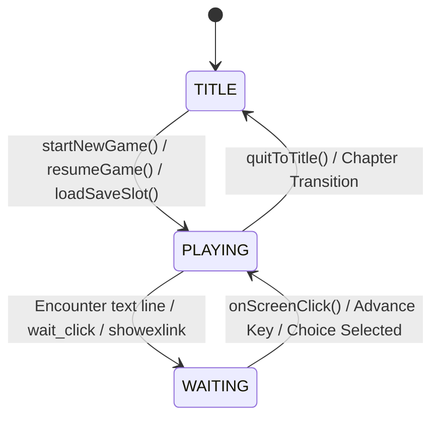

# State Machine & Hook Architecture

The heart of the runtime is `useKagRunner.ts`, which acts as an asynchronous state machine driver.

---

## 🔄 Lifecycle & State Transitions



---

## 📦 Key State Variables

| State Field | Type | Description |
| :--- | :--- | :--- |
| `gameState` | `'TITLE' \| 'PLAYING'` | Whether the game is currently on the title screen or in active gameplay. |
| `currentScenario` | `string` | The active scenario script name (e.g. `'g01'`, `'gt08'`). |
| `pointer` | `number` | Index in `scenarioData.instructions` currently being processed. |
| `isWaiting` | `boolean` | `true` when engine is paused waiting for user input on dialogue or click. |
| `showOptions` | `ChoiceOption[] \| null` | Non-null when an interactive choice branch is active. |
| `isAutoMode` | `boolean` | When enabled, automatically advances text based on reading length calculation. |
| `isFastForward` | `boolean` | When enabled, rapidly skips through read text at 80ms intervals. |
| `f` | `GameVariables` | Local story flags and heroine affection counters. |
| `sf` | `SystemFlags` | Global flags (read scenario markers, volume, opacity, blur, immerse mode). |
| `tf` | `Record<string, any>` | Ephemeral temporary scenario flags. |

---

## ⚡ Non-Blocking State Synchronization

To avoid React stale-closure traps during high-frequency execution loops (such as Fast-Forward mode at 80ms ticks), the runner maintains synchronized `useRef` mirrors:
```typescript
const fRef = useRef<GameVariables>(f);
useEffect(() => { fRef.current = f; }, [f]);

const pointerRef = useRef<number>(pointer);
useEffect(() => { pointerRef.current = pointer; }, [pointer]);
```

This guarantees that timer callbacks and keyboard listeners always read current game state without causing unwanted re-renders.
