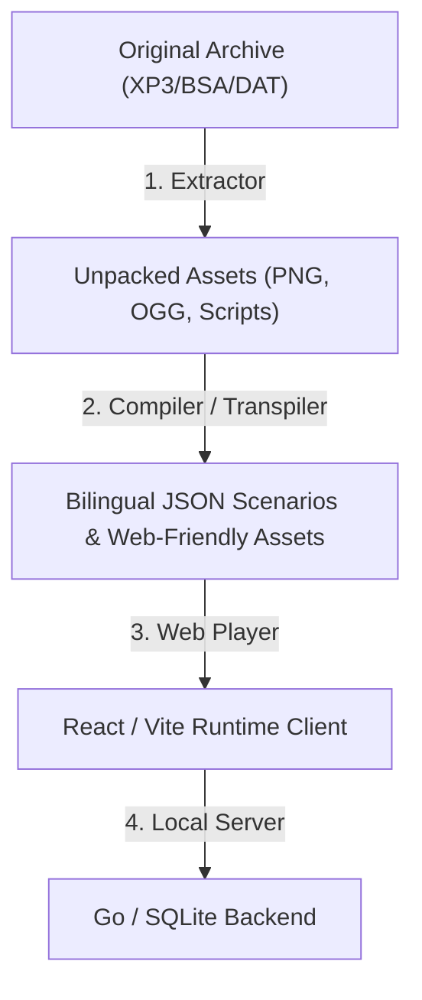

# The "SCUMMVM for Visual Novels": Preserving & Renewing the 2008 Era

The success of renewing **"G弦上的魔王" (The Devil on G-String)** highlights a powerful pattern for visual novel preservation. Rather than using low-level emulation (like running Windows XP in a virtual machine or wrestling with Wine), we extracted the game's assets (images, audio, scenarios) and rebuilt the runtime VM in a modern React + Vite + Go web stack.

This document explores the landscape of visual novels from the **2008 golden era**, compares this workflow to emulation engines like **SCUMMVM**, and outlines potential future candidates for this renewal treatment.

---

## 1. Comparing Emulation (SCUMMVM) vs. Web-Based Renewal

**SCUMMVM** is a landmark project that compiles the virtual machines of classic adventure games (SCUMM, AGI, SCI) to run natively on modern operating systems. Our approach of **Scenario Transpilation + Web Player** shares the same spirit but offers key advantages suited for visual novels:

| Feature | Low-Level Emulation (Wine/VMs) | SCUMMVM Approach (Rebuilt VM) | Web-Based Renewal (Our Stack) |
| :--- | :--- | :--- | :--- |
| **Platform Portability** | Poor (relies on OS-specific compatibility layers) | Good (cross-compiled native executables) | **Excellent** (zero-install, runs on mobile, desktop, tablets via standard browsers) |
| **Aesthetic Upgrades** | None (fixed original UI/UX constraints) | Limited (basic resolution scaling/filters) | **Unlimited** (CSS glassmorphism, responsive choices, custom font loading, smooth blur effects) |
| **Feature Injection** | Impossible | Hard (requires patching C++ engine code) | **Trivial** (adding modern typewriters, flowcharts, customizable dialogue opacities, and instant autosave states) |
| **Localization & Furigana** | Native to original assets | Limited | **Native** (easy integration of HTML `<ruby>` tags, bilingual sub-viewing, and external translation hooks) |

---

## 2. Key Visual Novels of the 2008 Era & Their Engines

Around 2008, the Japanese visual novel market reached a creative peak. Many highly acclaimed titles remain locked behind obsolete Windows dependencies, outdated screen resolutions (often 800x600 or 1024x768), and legacy Japanese code page requirements (Shift-JIS/CP932).

### A. Kirikiri2 / KAG (KiriKiri Adventure Game)
This is the engine used by *G-senjou no Maou*. Reusing the transpiler and player components from this project opens up easy renewals for other masterpieces:
*   **Fate/stay night (Realta Nua)** & **Fate/hollow ataraxia** (Type-Moon): Legendary stories with rich animations, sprite compositions, and branch choices.
*   **Sharin no Kuni, Himawari no Shoujo (车轮之国、向日葵的少女)** (Akabeisoft2, 2005/2007): Written by Loose Boy (same writer as *G-senjou no Maou*), sharing almost identical KAG macros.
*   **Mahoutsukai no Yoru (魔法使之夜)** (Type-Moon, 2012): Although slightly later, it uses Kirikiri3 with advanced visual/animation script structures.

### B. NScripter / ONScripter
NScripter was the dominant engine for doujin/indie developers in the mid-2000s. Its scripting syntax is simple, line-oriented, and highly emulatable:
*   **Umineko no Naku Koro ni (海猫鸣泣之时)** (07th Expansion, 2008): A massive murder-mystery sound novel. Porting this to a web interface would allow players to easily switch between original and PS3 sprites, manage sound layers, and keep backlog records.
*   **Higurashi no Naku Koro ni (寒蝉鸣泣之时)** (07th Expansion, 2002–2006).
*   **Tsukihime** (Type-Moon, 2000).

### C. SiglusEngine / RealLive
Key’s proprietary engines power some of the most emotional visual novels of the era:
*   **Little Busters! Ecstasy** (Key, 2008): Uses SiglusEngine/RealLive. Contains minigames (baseball, battle ranking) embedded inside the script.
*   **Clannad** (Key, 2004) & **Rewrite** (Key, 2011).

---

## 3. The Re-Implementation Roadmap: Scalable Web Visual Novels

To scale this preservation model to other games and engines, the architecture we used can be generalized into a three-stage toolchain:



### Stage 1: Asset Pipeline (Extractor)
*   Decrypt and unpack proprietary archives (e.g., `.xp3` for Kirikiri, `.nsa` for NScripter).
*   Batch convert raw images to web-optimized formats (e.g., lossy PNG or WebP) to save bandwidth.
*   Standardize voice and music tracks to loopable `.ogg` or `.mp3`.

### Stage 2: Scenario Compiler (Transpiler)
*   Parse scenario text files (handling CP932 / Shift-JIS character encoding).
*   Map engine-specific commands (such as character sprite positioning, layers, background transitions, and BGM commands) to a unified JSON instruction format:
    ```json
    { "type": "command", "name": "bg", "args": { "storage": "bg_01" } },
    { "type": "text", "text_jp": "「おはよう」", "text_en": "\"Good morning.\"" }
    ```

### Stage 3: Unified React VM Player
*   Render character layers using absolute viewport layout matrices.
*   Manage independent audio channels: BGM (ambient loop), Sound Effects (one-shot), and Voice (interruptible).
*   Provide standard UI overlays: Settings (audio levels, custom text typewriter, opacity/blur sliders), History Log Backlog, and Flowchart Navigation.

---

## 4. Conclusion

Web-based renewals represent the future of retro game preservation. By decoupling the narrative script and assets from 32-bit Windows system calls and displaying them inside an optimized HTML5 browser runtime, we ensure these stories remain playable for decades to come, on any device.
